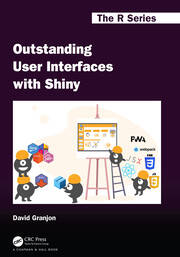
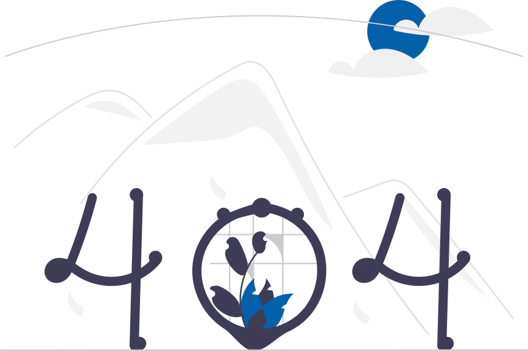
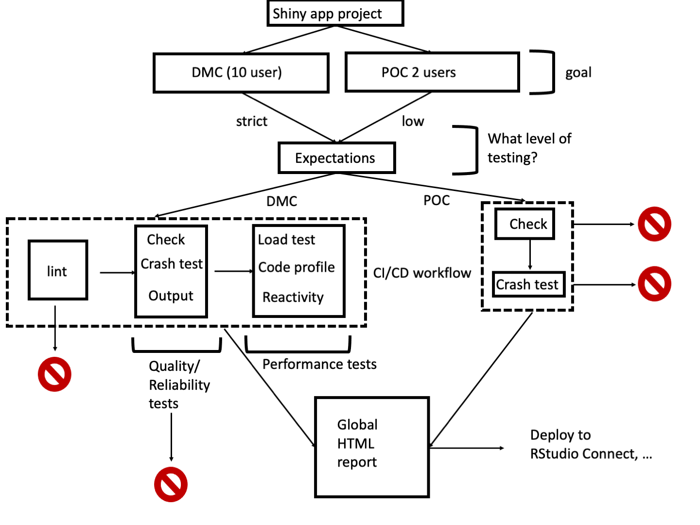

class: inverse, center, title-slide, middle

```{r setup, include=FALSE}
library(emo)
library(shiny)
library(countdown)
library(magrittr)
options(htmltools.dir.version = FALSE)
knitr::opts_chunk$set(
  fig.width = 10, fig.height = 6, fig.retina = 2,
  warning = FALSE, message = FALSE
)

#xaringanExtra::use_search(show_icon = TRUE)
xaringanExtra::use_tile_view()
xaringanExtra::use_share_again()
xaringanExtra::use_clipboard()
xaringanExtra::use_tachyons()
xaringanExtra::use_fit_screen()
xaringanExtra::use_panelset()

xaringanExtra::use_extra_styles(
  hover_code_line = TRUE,         #<<
  mute_unhighlighted_code = TRUE  #<<
)
```

## {shinyValidator}: toward a new audit process for Shiny apps quality through CI/CD

###### AppsilonConf 2022 `r format(Sys.time(), "%b %d")`

.flex.tc[
.w-30.mr3.center[

<br>
.f5[David Granjon]

.small[Senior Expert Data Scientist]
]
]


```{r js4shiny, echo=FALSE}
js4shiny::html_setup(stylize = c("fonts", "variables", "code"))
```

---
class: header_background
#  apps may look amazing ...

<br/>

`{Shiny}` is about __10__ years old 😲😲😲. 

--

Today, many tools can make your apps __shining__...

.center[
```{r, echo = FALSE, out.width='20%'}

```
]

---
class: header_background
# Clothes don't make the man

<br/>

Yet ... too many __unexplained__ syndromes:

--

- The well known "It worked for me ... but not for you" 🤷‍♀️
- The famous "It was fine yesterday" 😎
- And many others...
  
---
class: header_background
# Clothes don't make the man

<br/>

.center[

]

Your app may be as beautiful and as cool as you want, it is __useless__ if it does not start/run. 

---
class: header_background
# Most Shiny apps are "just" prototypes

<br/>

Why is my app not starting/running ❓

--

Possible answers:

- __Quickly__ developed, no planning 😱
- No code quality __management__ 😱
- No __tests__ 😱 
- ...

--

This must stop `r ji("smiling_imp")`!

---
class: header_background
# About software validation

<br/>

Check that a product is __conform__ to initial __requirements__ (Software engineering). 

--

For Shiny apps: 

- __Reliability__: is the app doing what it is intended to do?
- __Stability__: how often does it crash?
- __Performance/Availability__: is the app fast enough to handle multiple concurrent users?

--

In practice, a few apps meet all these requirements `r ji("smiling_imp")`. 
How do we transition from __prototypes__ to __production-ready__ tools ❓

---
class: inverse center middle title-slide-without-bg title-slide
# 1. Production Ready Shiny Apps

```{r, echo = FALSE, out.width='20%', fig.align='center'}
knitr::include_graphics("assets/images/jpeg/engineering-shiny.jpg")
```

---
class: header_background
# Consolidate Shiny apps projects

<br/>

.panelset[
.panel[.panel-name[Package your app]

.center[

]

- Easier checking, linting, documentation and testing.
- Just ... __easier__. 😀
]

.panel[.panel-name[Manage your __dependencies__]

.center[

]

- Fix package versions.
- Increased __reproducibility__.
]

.panel[.panel-name[__Test__ your code]

.center[

]

- Unit tests: test business logic. 
- Server testing: test how Shiny modules or pieces work together (with reactivity).
- UI testing: test UI components, snapshots, headless-testing (`{shinytest2}`).
]

.panel[.panel-name[Optimize]
Are there bottlenecks?
- __Load__ testing: How does the app behave with 10 simultaneous user? `{shinyloadtest}`.
- __Profiling__: What part of my app is slow?`{profvis}`.
- Reactivity: Are there any reactivity issues? .
]

]

---
class: header_background
# Stop ... I am lost ...

<br>

.center[

]

- There are just so many tools! How to use them properly?
- Is there a way to __automate__ all of this? I just don't have time ... 😞

---
class: inverse center middle title-slide-without-bg title-slide
# 3. Leveraging CI/CD

---
class: header_background
# What, why and how?

<br>

.panelset[
.panel[.panel-name[What]
- Continuous integration: automatically __check__ new features. 🏥
- Continuous deployment: automatically __deploy__ content. ✉️
- Running on a __remote__ environment ☁️:
  - [Github Actions](https://github.com/features/actions).
  - [Jenkins](https://www.jenkins.io/).
  - [Gitlab CI/CD](https://docs.gitlab.com/ee/ci/).
  
]

.panel[.panel-name[Benefits] 
- __Automated__.
- More __reproducible__ (more os/R flavors available).
- __Time saver__.
- Less duplication.
]

.panel[.panel-name[How?] 
Not easy 😢

- Select __DevOps__ platform (GitLab, GitHub, ...).
- Add __version control__ (git knowledge).
- Build custom GitLab runner (optional).
- Write __CI/CD instructions__ (better support for GitHub).
- Enjoy ...

Can't we make things easier❓
]

]

---
class: inverse center middle title-slide-without-bg title-slide
# 4. Welcome {shinyValidator}

---
class: header_background
# {shinyValidator}

<br>

.panelset[
.panel[.panel-name[Purpose]

- __Eases__ Shiny Apps validation:
  - __Provides__ plug and play CI/CD pipelines.
  - __Lints__ and __checks__ the package code.
  - Performs a Shiny app __crash test__.
  - Displays __outputs__ differences: plots, htmlwidgets.
  - Measure __performance__: load-test, profiling and reactivity checkup.
  
All is __integrated__ into a nice HTML report.

]

.panel[.panel-name[Requirements]

- Requires a __package__, especially with `{golem}`.
- Control R __dependencies__ with `{renv}`.
- Requires __git__ + remote repository.
- Have __unit tests__. 
]

.panel[.panel-name[Setup]
- Install it:
.small[
```{r, eval=FALSE}
remotes::install_github("Novartis/shinyValidator")
```
]
- Run `use_validator("github")` (for Github Actions).
- `devtools::document()`.
- Run `renv::snapshot()` to capture dependencies.
- Commit, push and enjoy. 🚀
]

]

---
class: header_background
# {shinyValidator}: audit app

<br>

`audit_app()` main package function:

.pull-left.small[
```r
audit_app(
  timeout = 5,
  headless_actions = NULL,
  workers = 5,
  scope = c("DMC", "POC"),
  output_validation = TRUE,
  coverage = TRUE,
  load_testing = TRUE,
  profile_code = TRUE,
  check_reactivity = TRUE,
  flow = TRUE
)
```
]

.pull-right[
```{r shinyvalidator-overview, echo=FALSE, out.width='100%'}

```
]

---
class: header_background
# Live Demo

<br>

Because a demo is better than 30 slides.

---
class: header_background
# Thanks 🙏🏻

<br>

- Barret Schloerke (RStudio).
- Peter Krusche (Novartis).
- Lucas Widmer (Novartis).
- Janice Branson (Novartis).
- Technology & Innovation Team (Novartis): Aleks, Bo, Marie, Dave, David, Mustapha, Ardalan, Bill and Stefan.
- Christophe Dervieux (RStudio).
- Sebastien Rochette (ThinkR).
- Romain Lesur (Insee).
- Katerina Limpitsouni (unDraw, illustrations).


---
# Follow me

<br>
-  [Twitter](https://twitter.com/divadnojnarg).
-  [Github](https://github.com/DivadNojnarg).
